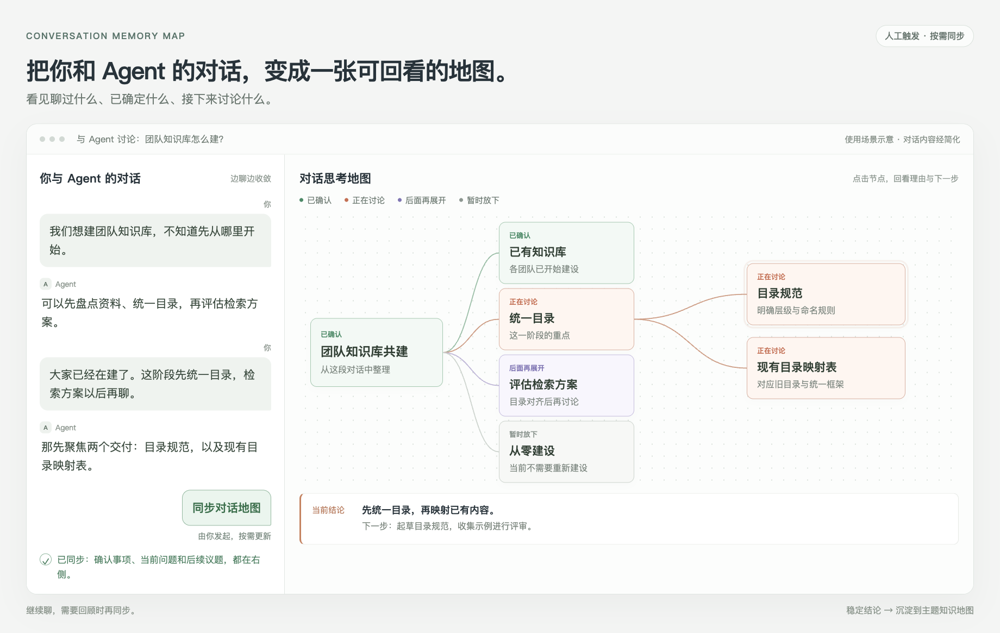

# Conversation Memory Map｜对话记忆地图

[中文](README.md) · [English](README_EN.md)

把你和 Agent 的对话，变成一张可以回看的信息地图。

你和 Agent 讨论需求、比较方案、澄清想法。聊得越久，越容易忘记之前说过什么、为什么改了方向、哪些问题还没解决。这个为 Codex 设计的 Skill，让你继续用对话思考，需要回顾时说一句“同步对话地图”，就在右侧看见讨论的脉络、当前结论和下一步。



*使用场景示意，非 Codex 界面截图。左侧是经过简化的对话，右侧是由这段对话整理出的地图；更新由用户主动触发。*

## 什么时候用

**和 Agent 一起推敲需求或方案时。** 讨论常常会从“要做什么”转向“这阶段先不做什么”。地图保留这些分支和取舍，帮助你回看方向是怎么收敛的，而不只是留下一版最终答案。

**和 Agent 一起学习、研究一个主题时。** 问题越问越多，概念、例子和待验证观点交织在一起。地图帮你看清哪些已经理解、哪些还需要展开；形成稳定结论后，再整理为以后可复用的知识。

**长对话中途回顾，或隔一段时间回来继续时。** 不必从头翻聊天记录，先看当前焦点、已确认事项和开放问题，再接着聊。

它是对话旁边的导航，不是要把每条消息都画成节点，也不是另起一套与讨论脱节的知识库目录。同步基于当前可访问的对话和已保存的地图，不会自动恢复已经不可见的历史。

## 从对话回顾，到知识沉淀

这个 Skill 维护两种互补的视图：

| 地图 | 作用 | 主要内容 |
|---|---|---|
| 对话思考地图 | 工作记忆：看清现在聊到哪里 | 讨论分支、状态、理由、当前结论、下一步 |
| 主题知识地图 | 长期记忆：沉淀以后还能复用的知识 | 概念、稳定结论、适用边界、证据、开放问题、版本 |

两张地图通过一条简单规则连接：**讨论 → 确认 → 判断是否可复用 → 沉淀为知识**。未经确认的观点不会被包装成事实，临时沟通也不会污染长期知识。

## 安装

将仓库克隆到 Codex Skills 目录：

```bash
git clone https://github.com/xi523/conversation-memory-map.git ~/.codex/skills/conversation-memory-map
```

目录已经存在时，不要覆盖，请先检查已安装的版本。重新打开 Codex 任务后即可显式调用。

## 如何触发

这个 Skill 依赖人工触发，已关闭隐式调用，不会在后台自行修改地图。首次使用或进入新任务时，用下方的 `$conversation-memory-map` 显式调用；同一对话中已经约定此工作流后，可以简称：

> 同步对话地图

也可以显式调用并指定范围：

```text
$conversation-memory-map 同步当前对话：更新思考地图，并把本轮已经确认且可复用的结论沉淀到主题知识地图，在右侧打开思考地图。
```

只更新当前讨论状态：

```text
$conversation-memory-map 只更新对话思考地图，不更新主题知识地图。
```

只做知识沉淀：

```text
$conversation-memory-map 检查本轮哪些内容已经形成稳定结论，去重后同步到主题知识地图，并保留依据、适用边界和版本变化。
```

## 对话思考地图长什么样

它不是普通的知识分类图，而是一张从左到右的讨论状态图。根节点表示总命题，只展开当前焦点所在的分支；节点固定使用“状态、短标题、一行说明”三段式，完整理由和下一步通过点击查看。

状态颜色保持固定：绿色表示已确认，红色表示正在讨论，紫色表示后面再展开，灰色表示暂时放下。颜色不再承担主题分类，避免越画越乱。

## 更新原则

每次同步优先更新已有节点的状态、结论和下一步，只有出现新的独立问题才增加分支。同一主题的地图原位更新，不为每轮对话重复创建文件或标签页。

当讨论节点转为“已确认”时，Skill 会判断它是否具有未来复用价值。只有稳定、可追溯、能说明适用边界的内容，才会进入主题知识地图。

## 项目结构

```text
conversation-memory-map/
├── SKILL.md                       # Codex 使用的英文 Skill 指令
├── SKILL.zh-CN.md                 # 中文版 Skill 指令
├── agents/openai.yaml             # Skill 展示与调用配置
├── references/map-spec.md         # 英文双地图规范
├── references/map-spec.zh-CN.md   # 中文双地图规范
└── examples/
    ├── knowledge-base-conversation-map.png # 中文：左侧对话，右侧地图
    ├── conversation-to-map-en.png          # 英文场景示例
    └── conversation-to-map.html            # 示例源文件，#en 切换英文
```

示例 HTML 可直接在浏览器中打开，点击节点查看对应解释。它用于演示呈现方式，不会读取或监听你的实际对话。

## License

[MIT](LICENSE)
