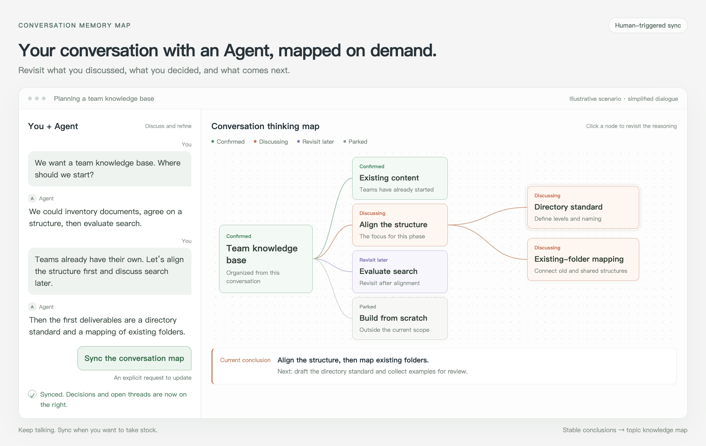

# Conversation Memory Map

[中文](README.md) · [English](README_EN.md)

Turn conversations with your Agent into a visual map you can revisit.

You discuss requirements, compare options, and refine ideas with an Agent. As the conversation grows, it becomes harder to remember what you covered, why the direction changed, and what is still unresolved. Designed for Codex, this skill lets you keep thinking through conversation. When you want to take stock, say “Sync the conversation map” to see the discussion, current conclusions, and next steps on the right.



*An illustrative scenario, not a screenshot of the Codex interface. The left panel shows a simplified conversation; the right panel organizes that conversation into a map. Updates are explicitly requested by the user.*

## When to use it

**Working through requirements or options with an Agent.** A discussion often moves from “what should we build?” to “what is outside this phase?” The map keeps those branches and trade-offs visible, so you can revisit how the direction narrowed, not just read the final answer.

**Learning or researching a topic with an Agent.** Concepts, examples, and untested ideas accumulate as you ask more questions. The map shows what is understood and what still needs exploration. Stable conclusions can then become reusable knowledge.

**Taking stock during a long conversation, or returning to it later.** Instead of scrolling back through every message, review the current focus, confirmed points, and open questions before continuing.

Think of it as navigation alongside your conversation, not a node for every message or a knowledge taxonomy disconnected from the discussion. A sync uses the conversation context and saved maps currently available to the Agent; it cannot automatically recover inaccessible history.

## From conversation recall to reusable knowledge

The skill maintains two complementary views:

| Map | Purpose | What it keeps |
|---|---|---|
| Conversation thinking map | Working memory: where the discussion is now | Branches, states, rationale, current conclusion, next step |
| Topic knowledge map | Long-term memory: what can be reused later | Concepts, stable conclusions, scope, evidence, open questions, versions |

The two maps are connected by a simple promotion rule: **discussion → confirmation → reusability check → durable knowledge**. Unconfirmed opinions are not presented as facts, and transient coordination does not pollute the knowledge layer.

## Installation

Clone the repository into your Codex skills directory:

```bash
git clone https://github.com/xi523/conversation-memory-map.git ~/.codex/skills/conversation-memory-map
```

If the directory already exists, inspect the installed version before making changes. Open a new Codex task to invoke the skill explicitly.

## Triggering the skill

The skill is intentionally human-triggered, with implicit invocation disabled. It never changes maps in the background. Use `$conversation-memory-map` explicitly on first use or in a new task. Once the workflow is established in the same conversation, the shorthand can be:

> Sync the conversation map.

For an explicit dual-map update:

```text
$conversation-memory-map Sync this conversation. Update the thinking map, promote confirmed and reusable conclusions to the topic knowledge map, and open the thinking map on the right.
```

Update only the live discussion state:

```text
$conversation-memory-map Update only the conversation thinking map. Do not update the topic knowledge map.
```

Promote durable knowledge only:

```text
$conversation-memory-map Identify stable, reusable conclusions from this discussion and merge them into the topic knowledge map with evidence, scope, and version history.
```

## What the thinking map looks like

It is a left-to-right discussion-state map, not a generic knowledge taxonomy. The root is the governing question. Only the current branch expands. Every node follows the same compact grammar: state, short title, and one-line note. Rationale and next steps remain available on click.

Status colors are fixed: green means confirmed, red means active, purple means revisit later, and gray means parked. Color never doubles as topic categorization.

## Update behavior

Each sync updates existing node states, conclusions, and next steps before adding branches. A new branch is created only for a genuinely independent question. Existing map files are updated in place instead of creating a new file or browser tab for every turn.

When a discussion node becomes confirmed, the skill checks whether it is reusable, traceable, and scoped. Only then is it promoted into the topic knowledge map.

## Repository structure

```text
conversation-memory-map/
├── SKILL.md                       # Canonical Codex skill instructions
├── SKILL.zh-CN.md                 # Chinese translation
├── agents/openai.yaml             # Skill UI and invocation metadata
├── references/map-spec.md         # English dual-map specification
├── references/map-spec.zh-CN.md   # Chinese dual-map specification
└── examples/
    ├── knowledge-base-conversation-map.png # Chinese conversation + map
    ├── conversation-to-map-en.png          # English scenario example
    └── conversation-to-map.html            # Example source; #en for English
```

Open the example HTML directly in a browser and click nodes to see their explanations. It demonstrates the presentation only; it does not read or listen to your real conversations.

## License

[MIT](LICENSE)
